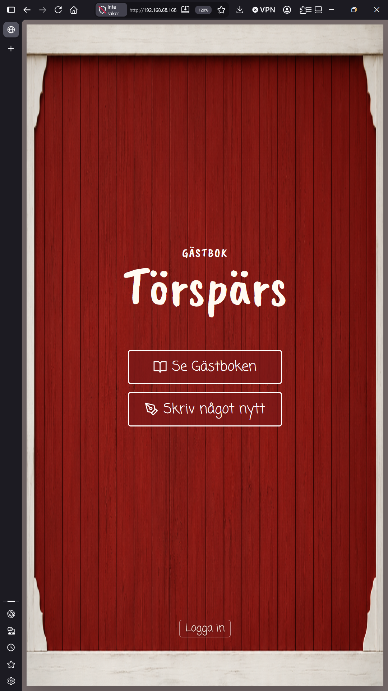
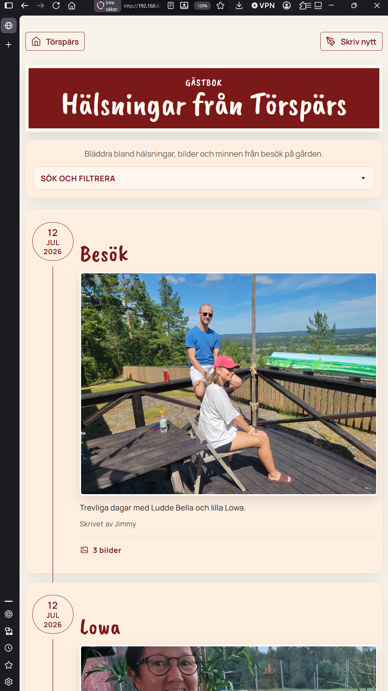
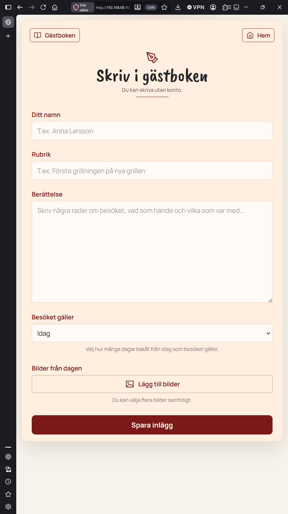

# Gästbok

A private guestbook for our family's summer house, self-hosted on a
Raspberry Pi 5 and reachable only on the local wifi.

Visitors write about their stay and add photos. Family members log in to
write longer entries, choose who can see them, and browse the house's
history by family, event or date.

<p>
  
  
  
</p>

## Features

- **Guest entries** without an account: name, story, photos and how many
  days the stay lasted (up to 14). Guest entries are always public.
- **Member entries** tied to a profile and family, with a date range and
  visibility (everyone or members only).
- **Families** with branches, and a page per family.
- **Events** (for example a summer or a celebration). New entries are
  linked to the event that is active on the day they are written.
- **Search** by title, story, person, family or event, and filtering by
  date and event.
- **Photos** with previews before upload; upload order is kept.
- Moderation through Django Admin.

The interface is in Swedish.

## Architecture

```
guestbook/
  rules.py       Pure rules (allowed stay lengths)
  selectors.py   Read queries: visibility, search, active event
  services.py    Use cases: create guest and member entries
  forms.py       Input contracts for guests and members
  views.py       HTTP layer only
accounts/        Families and profiles (a profile is created per user)
pages/           Start page
```

Views stay thin: reading goes through selectors, writing through
services, and domain rules are validated in the services as well as
the forms.

## Local development

```bash
python3 -m venv .venv
.venv/bin/pip install -r requirements.txt
make migrate
make run-dev
```

Other commands:

```bash
make test            # run the test suite
make check           # Django system checks
make help            # all commands
```

To create an administrator:

```bash
DJANGO_SECRET_KEY=dev-secret-key DJANGO_DEBUG=True \
  .venv/bin/python manage.py createsuperuser
```

## Deployment on the Raspberry Pi

```
LAN → nginx :80 ─┬─ /static/ → staticfiles/
                 ├─ /media/  → media/
                 └─ /        → gunicorn 127.0.0.1:8000 (systemd)
```

| File in this repo | Location on the Pi |
|---|---|
| `docs/deploy/gastbok.service` | `/etc/systemd/system/gastbok.service` |
| `docs/deploy/nginx-gastbok.conf` | `/etc/nginx/sites-available/gastbok` |
| `docs/deploy/gastbok.env.example` | `/etc/gastbok/gastbok.env` (root:karlal, 640) |
| `docs/deploy/backup.sh` | `/usr/local/bin/gastbok-backup` |

The app is a git clone in `/srv/gastbok/current`. The database is
SQLite and uploaded photos live in `media/`.

### Updating

```bash
sh /srv/gastbok/current/docs/deploy/update.sh
```

This backs up, pulls `main`, installs dependencies, runs checks,
migrations and `collectstatic`, and restarts the service.

### Backups

`backup.sh` copies the database (using SQLite's online backup) and
the photos every night and keeps 30 days:

```bash
sudo cp docs/deploy/backup.sh /usr/local/bin/gastbok-backup
sudo chmod +x /usr/local/bin/gastbok-backup
crontab -e    # 15 3 * * * /usr/local/bin/gastbok-backup
```

Point `BACKUP_DIR` at storage other than the SD card, such as a USB
stick, so a failing card does not take the backups with it.

## License

MIT
